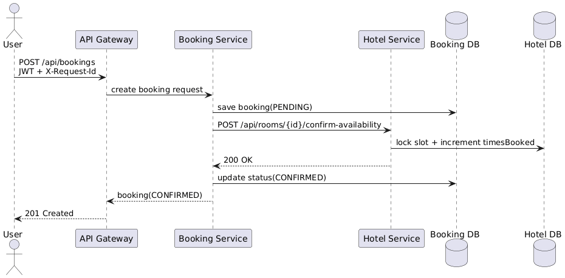
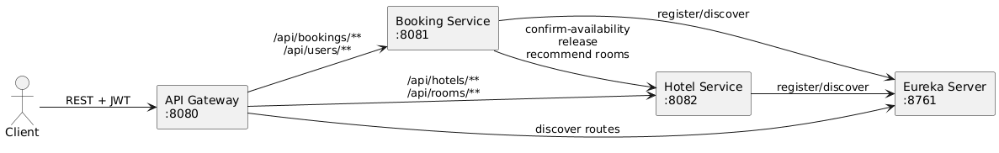
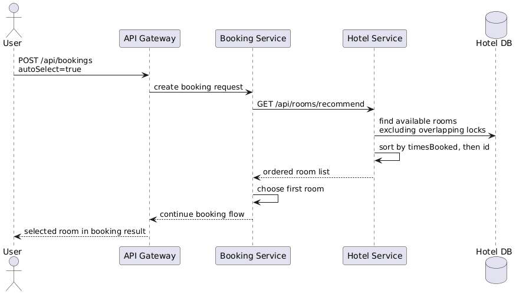

# MEPhI Spring Hotel Booking Service

Микросервисный учебный проект на Spring Boot для системы бронирования отелей.

## Состав

- `eureka-server` — service registry.
- `api-gateway` — входной шлюз и маршрутизация.
- `booking-service` — пользователи, JWT, бронирования, двухшаговая согласованность.
- `hotel-service` — отели, номера, рекомендации по `timesBooked`, подтверждение доступности.

## Стек

- Java 17
- Spring Boot 3.5.0
- Spring Cloud 2025.0.0
- Spring Security + JWT
- Spring Data JPA + H2
- Spring Cloud Gateway
- Spring Cloud Netflix Eureka
- springdoc OpenAPI
- Lombok, MapStruct
- JUnit 5 + MockMvc

## Запуск

Сначала запустите registry:

```bash
./mvnw -pl eureka-server spring-boot:run
```

Затем `hotel-service`:

```bash
./mvnw -pl hotel-service spring-boot:run
```

Потом `booking-service`:

```bash
./mvnw -pl booking-service spring-boot:run
```

И в конце `api-gateway`:

```bash
./mvnw -pl api-gateway spring-boot:run
```

## Docker Compose

Иначе собрать и поднять все сервисы можно одной командой:

```bash
docker compose up --build
```

После старта будут доступны:

- Gateway: `http://localhost:8080`
- Eureka: `http://localhost:8761`
- Booking Swagger: `http://localhost:8081/swagger-ui.html`
- Hotel Swagger: `http://localhost:8082/swagger-ui.html`

Остановить сервисы:

```bash
docker compose down
```

## Порты

- Gateway: `8080`
- Booking Service: `8081`
- Hotel Service: `8082`
- Eureka Server: `8761`

## Swagger

- Booking Service: `http://localhost:8081/swagger-ui.html`
- Hotel Service: `http://localhost:8082/swagger-ui.html`

## Тесты

```bash
./mvnw test
```

## Базовые сценарии

1. Зарегистрировать пользователя через `POST /api/users/register` в `booking-service`.
2. Получить JWT и передавать его в `Authorization: Bearer <token>`.
3. Администратором создать отель и комнаты.
4. Пользователем запросить свободные или рекомендованные комнаты.
5. Создать бронирование через `POST /api/bookings` с `X-Request-Id`.

## Архитектура


## Основные сценарии

### Успешное бронирование


### Ошибка подтверждения и компенсация


### Автоподбор комнаты


## Пояснения к некоторым ключевым решениям (ADR)

### Согласованность через локальные транзакции и компенсацию

`booking-service` сначала фиксирует локальное бронирование в статусе `PENDING`, затем вызывает `hotel-service` для подтверждения доступности номера.
При ошибке или тайм-ауте выполняется компенсация через `release`, а бронь переводится в `CANCELLED`.

### Планирование занятости по простому счётчику

Для автоподбора используется простая и объяснимая стратегия: выбрать только свободные комнаты на указанный период и отсортировать их по `timesBooked`, затем по `id`.
